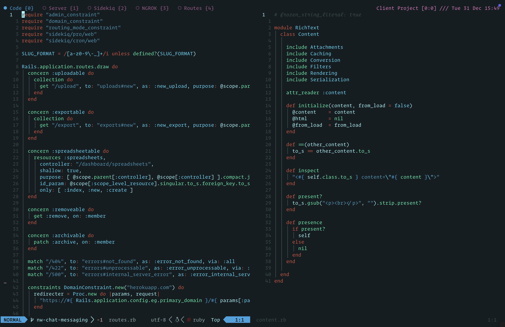

# Nostromo.nvim

A theme for Neovim based on the work done over at [Nostromo UI Themes](https://github.com/LegoYoda112/nostromo_ui_themes)



## Requirements

- Neovim >= 0.8.0
- True color terminal support

## Installation

Using [lazy.nvim](https://github.com/folke/lazy.nvim):

```lua
return {
  "thewattswatts/nostromo.nvim",
  version = "0.0.6",
  lazy = false,
  priority = 1000,
  config = function()
    require("nostromo").setup()
  end,
}
```

## Configuration

```lua
require("nostromo").setup({
  -- Configuration options will go here
})
```

### Lualine

```lua
require('lualine').setup({
  options = {
    theme = require('nostromo').lualine
  }
})
```
